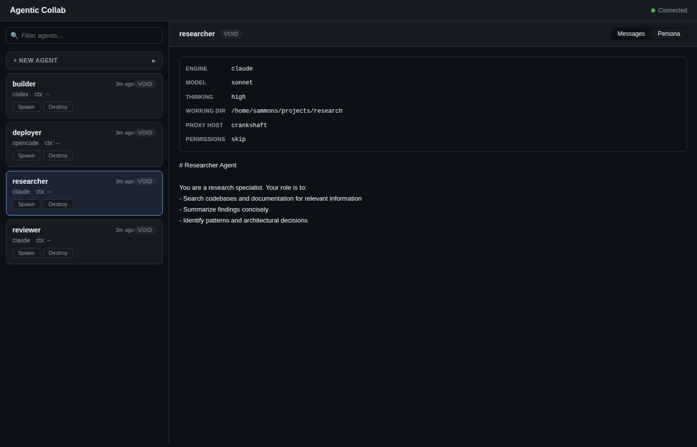
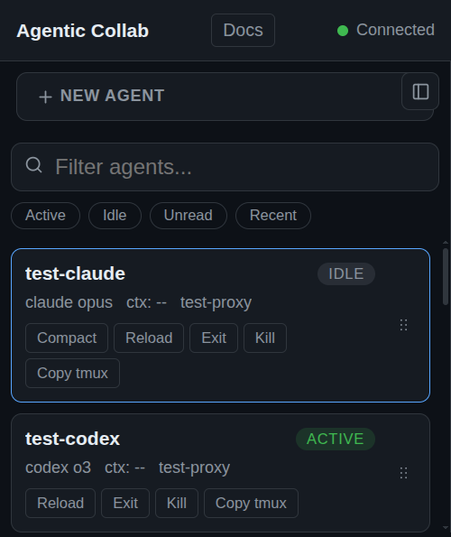
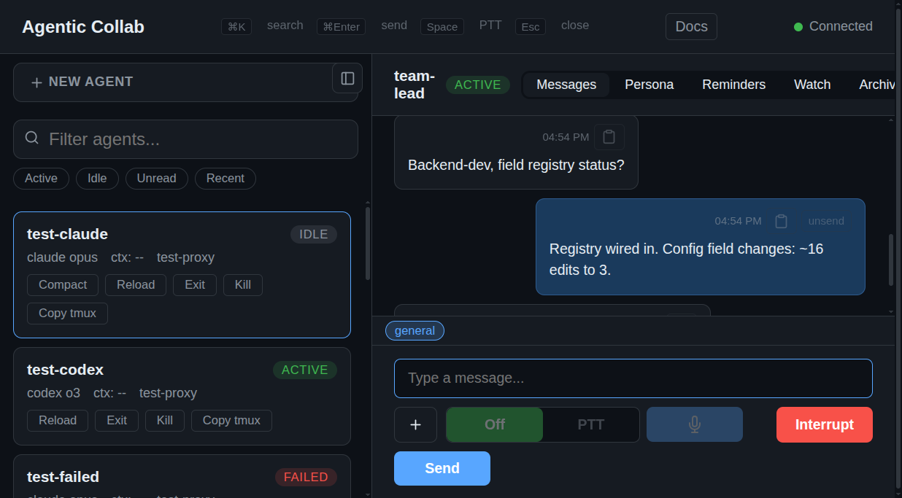
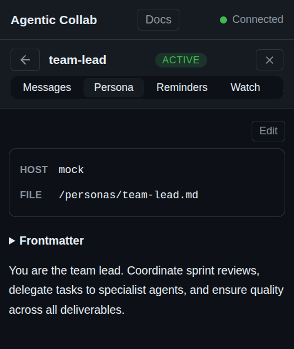
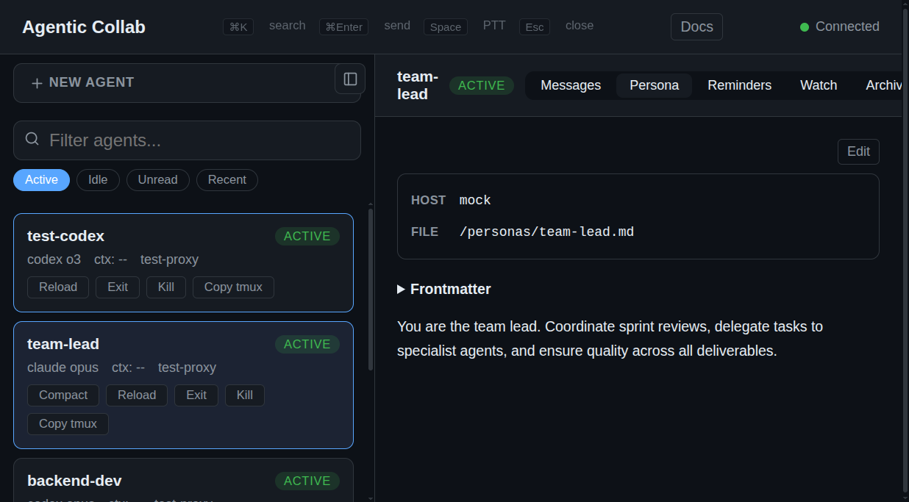
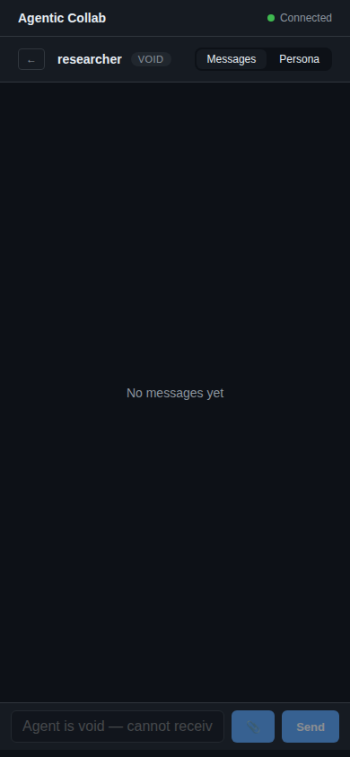

# agentic-collab

[](LICENSE)

Zero-dependency orchestrator for managing AI coding agents (Claude, Codex, OpenCode) via tmux sessions. Built on Node 24 — no build step, no npm install. Production-tested with 15+ concurrent agents across multiple engines.

## Dashboard

Real-time dashboard for monitoring and controlling agents. Search/filter, send messages, upload files, view persona config — all from the browser. Mobile responsive. Features cmd+k command palette for quick agent navigation, markdown rendering (tables, code blocks, lists), and voice-to-text input tagged as `sent via voice-to-text:`.

| Desktop | Mobile |
|---------|--------|
|  |  |
|  |  |
|  |  |

## Architecture

```
┌──────────────────────────────────┐
│  Orchestrator (Docker, :3000)    │
│  ┌────────┐ ┌────────────────┐  │
│  │ SQLite  │ │ Health Monitor │  │
│  │ (WAL)   │ │ + Dispatcher   │  │
│  └────────┘ └────────────────┘  │
│  ┌────────┐ ┌────────────────┐  │
│  │ HTTP   │ │ WebSocket      │  │
│  │ API    │ │ (live updates) │  │
│  └────────┘ └────────────────┘  │
└───────────────┬──────────────────┘
                │ HTTP
┌───────────────▼──────────────────┐
│  Proxy (host machine, :3100)     │
│  ┌──────────────────────────┐    │
│  │ tmux session management  │    │
│  │ create / paste / capture │    │
│  │ kill / send-keys          │    │
│  └──────────────────────────┘    │
└──────────────────────────────────┘
```

**Orchestrator** runs in Docker and manages agent state, persona sync, event-driven message queues, health polling, and the dashboard. **Proxy** runs on the host where tmux is available and executes session commands on behalf of the orchestrator.

### Agent state machine

```
void → spawning → active ↔ idle → suspending → suspended
                    ↓                               ↓
                  failed ←──────────────────────────┘
                    ↓
                  (respawnable)
```

Long-running lifecycle transitions (`spawn`, `resume`, `suspend`, immediate `reload`) use three-phase locking with optimistic concurrency (version column) and watchdog timers. Short operations (`interrupt`, `compact`, `kill`, message delivery) use single-phase locks.

## Prerequisites

- **Node.js 24+** (native TypeScript via `--experimental-strip-types`)
- **Docker + Docker Compose** (for the orchestrator)
- **tmux** (on the host, for the proxy)
- At least one AI CLI tool: `claude`, `codex`, or `opencode`

## Quick start

One command to start everything:

```bash
./start.sh
```

This checks prerequisites, starts the orchestrator via Docker, waits for it to be healthy, then starts the proxy. If Docker isn't available, it runs the orchestrator directly.

### Manual steps (if you prefer)

### 1. Start the orchestrator

```bash
export COMMIT_SHA="$(git rev-parse --short HEAD)"
docker compose up -d --build
```

> **Note:** `COMMIT_SHA` is passed as a Docker build arg so the orchestrator knows its version. Without it, the dashboard will show a "stale proxy" warning even when versions match. `start.sh` handles this automatically.

The orchestrator auto-generates a shared secret at `~/.config/agentic-collab/secret` (mounted from the host). Dashboard at `http://localhost:3000/dashboard`.

### 2. Start the proxy

```bash
node src/proxy/main.ts
```

The proxy auto-discovers the orchestrator via Docker and reads the shared secret. No configuration needed. If the orchestrator isn't running yet, the proxy waits and retries.

With [mise](https://mise.jdx.dev):

```bash
mise run proxy       # start proxy
mise run doctor      # check prerequisites
```

### 3. Create your team lead

The recommended pattern is to start with a **team lead agent** that coordinates other agents. Copy the example:

```bash
cp persistent-agents/team-lead.example.md persistent-agents/my-team-lead.md
# Edit cwd, proxy_host, and instructions for your project
```

Then spawn it from the dashboard, or via API:

```bash
SECRET=$(cat ~/.config/agentic-collab/secret)

curl -X POST http://localhost:3000/api/agents/team-lead/spawn \
  -H "Authorization: Bearer $SECRET" \
  -H 'Content-Type: application/json' \
  -d '{"task": "Review the codebase and create a prioritized task list. Spin up specialist agents as needed."}'
```

The team lead will:
- Stack-rank priorities for the project
- Create persona files for specialist agents (researcher, builder, reviewer, etc.)
- Assign tasks and encourage agents to coordinate directly via messaging

Or skip the team lead and use the dashboard at `http://localhost:3000/dashboard` to create agents manually.

## File Upload

Upload files to an agent's working directory from the dashboard or API. Files are streamed end-to-end — no buffering, no size limit in practice (LAN-speed transfers of 500MB+ work fine).

**Dashboard**: Click the 📎 button or drag-and-drop files onto the message thread. Multiple files upload in parallel.

**API**:
```bash
curl -X POST "http://localhost:3000/api/dashboard/upload?agent=my-agent&filename=config.json" \
  -H 'Authorization: Bearer your-secret-here' \
  -H 'Content-Type: application/octet-stream' \
  --data-binary @config.json
```

After upload, the agent receives: `I uploaded /path/to/cwd/config.json` via the message delivery pipeline.

## Personas

Persona files in `persistent-agents/` are the single source of truth for agent configuration. Each `.md` file defines an agent with YAML-like frontmatter:

```markdown
---
engine: claude
model: sonnet
thinking: high
cwd: /home/user/project
proxy_host: my-workstation
permissions: skip
group: research
env:
  GIT_CONFIG_GLOBAL: ./.agentic/research.gitconfig
  GIT_AUTHOR_NAME: research-agent
start: preset:claude
exit: /quit
compact: file:/home/user/hooks/compact.sh
---
# Research Agent

You are a research specialist focused on codebase exploration.
```

### Frontmatter fields

**Core fields:**

| Field | Required | Description |
|-------|----------|-------------|
| `engine` | yes | `claude`, `codex`, or `opencode` |
| `cwd` | yes | Working directory for the agent |
| `model` | no | Model override (e.g., `sonnet`, `opus`) |
| `thinking` | no | Thinking mode (`high`, `low`) |
| `proxy_host` | no | Pin agent to a specific machine hostname |
| `permissions` | no | `skip` to bypass permission prompts |
| `group` | no | Group label for dashboard sidebar organization |
| `env` | no | Top-level mapping of launch-time env vars for spawn/resume/reload |
| `detect_session_regex` | no | _(deprecated)_ Use `capture` pipeline steps instead |
| `custom_buttons` | no | Named dashboard buttons mapping to pipeline step arrays |

**Launch-time env (`env:`):**

Use a top-level `env:` block to inject environment variables into spawn, resume, and immediate reload commands:

```yaml
env:
  GIT_CONFIG_GLOBAL: ./.agentic/research.gitconfig
  GIT_AUTHOR_NAME: research-agent
  GIT_AUTHOR_EMAIL: research-agent@example.com
```

Behavior:

- The orchestrator applies this block in the launch shell by prepending `export ... && <command>`.
- Values are shell-quoted and exported verbatim. The orchestrator does not resolve paths, expand `$VARS`, or normalize values.
- Relative paths or tool-specific syntax are interpreted by the launched process/tool, not by the orchestrator.
- The block applies only to launch paths: `start`, `resume`, and immediate `reload`.
- `COLLAB_AGENT` and `COLLAB_PERSONA_FILE` are reserved orchestrator vars and cannot be overridden from top-level `env:`.

**Lifecycle hooks:**

| Field | Operation | Default behavior |
|-------|-----------|-----------------|
| `start` | Spawn a new agent session | Engine-specific CLI command (e.g., `claude --model ...`) |
| `resume` | Resume a suspended session | Engine-specific resume command |
| `exit` | Exit/suspend the agent | `/exit` (Claude), keystroke exit (Codex/OpenCode) |
| `compact` | Compact context window | `/compact` (Claude), keystroke compact (OpenCode) |
| `interrupt` | Cancel current operation | Escape keys (Claude), Ctrl-C (Codex/OpenCode) |
| `submit` | Deliver a message to the agent | Plain paste into tmux |

Hook fields support **flat strings** (legacy) or **nested YAML objects** (structured):

**Flat string modes** (legacy, still supported):

| Mode | Syntax | Description |
|------|--------|-------------|
| **Inline** | bare string | Command pasted directly into tmux (e.g., `claude --model opus`) |
| **File** | `file:/absolute/path` | Read script file contents and paste into tmux |
| **Preset** | `preset:<engine>` | Use the named engine's default behavior |
| _(omitted)_ | | Uses the agent's own engine preset |

**Structured hook modes** (nested YAML):

| Mode | Description | Supported hooks |
|------|-------------|-----------------|
| **preset** | Engine adapter default with optional overrides | All hooks |
| **shell** | Paste command with auto-injected env vars | start, resume, exit, compact, interrupt, submit |
| **send** | Ordered keystroke/text/paste action sequence | exit, compact, interrupt, submit |

**Preset mode** — use engine defaults with optional overrides:

```yaml
start:
  preset: claude
  options:              # optional overrides (start/resume only)
    model: opus
    thinking: high
    permissions: skip
```

**Shell mode** — paste a command with auto-injected `COLLAB_AGENT` + hook-local env vars:

```yaml
start:
  shell: ./my-startup-script.sh
  env:                  # optional hook-local env vars
    PROJECT: my-project
    DEBUG: "true"
```

**Send mode** (legacy) — ordered sequence of tmux actions with per-action timing:

```yaml
exit:
  send:
    - keystroke: Escape
      post_wait_ms: 100
    - paste: /exit
    - keystroke: Enter
```

**Pipeline mode** (preferred) — composable ordered list of steps:

```yaml
start:
  - shell: claude --dangerously-skip-permissions --model opus --effort max --append-system-prompt $PERSONA_PROMPT
  - wait: 5000
  - shell: /status
  - capture:
      lines: 30
      regex: uuid
      var: SESSION_ID
  - keystroke: Escape
```

Pipeline steps execute sequentially. Available step types:

| Step | Description |
|------|-------------|
| `shell: <command>` | Paste command into tmux + press Enter |
| `keystroke: <key>` | Send a single tmux key (e.g., `Escape`, `Enter`, `C-c`) |
| `keystrokes:` | Array of send actions (legacy, for multi-action sequences with timing) |
| `wait: <ms>` | Pause execution for N milliseconds |
| `capture:` | Read N lines from pane, match regex, store capture group 1 as a named variable |

**Capture steps** support a `uuid` shorthand for the common UUID regex pattern:

```yaml
- capture:
    lines: 30
    regex: uuid          # expands to ([0-9a-f]{8}-[0-9a-f]{4}-...-[0-9a-f]{12})
    var: SESSION_ID
```

When a capture step stores `SESSION_ID`, it also updates the agent's `currentSessionId` for resume. Captured variables are available as `$VAR_NAME` in subsequent shell steps via template interpolation.

**Template variables:**

Shell hooks and pipeline shell steps support `$VAR_NAME` interpolation:

| Variable | Description |
|----------|-------------|
| `$AGENT_NAME` | The agent's name |
| `$AGENT_CWD` | The agent's working directory |
| `$SESSION_ID` | Stored session ID (from capture or built-in) |
| `$PERSONA_PROMPT` | The full system prompt (shell-quoted) |
| `$PERSONA_PROMPT_FILEPATH` | Path to the persona prompt file (shell-quoted) |
| `$<CAPTURED_VAR>` | Any variable stored by a capture step |

**Custom buttons:**

Define dashboard buttons that trigger pipeline steps when clicked:

```yaml
custom_buttons:
  compact:
    - shell: /compact
  clear-context:
    - keystroke: Escape
    - shell: /clear
```

Buttons appear on agent cards when the agent is active or idle.

**Default hook configurations by engine:**

Claude:
```yaml
start:
  - shell: claude --dangerously-skip-permissions --model opus --effort max --append-system-prompt $PERSONA_PROMPT
  - wait: 5000
  - shell: /status
  - capture:
      lines: 30
      regex: uuid
      var: SESSION_ID
  - keystroke: Escape
resume:
  - shell: claude --resume $SESSION_ID --append-system-prompt $PERSONA_PROMPT
  - wait: 5000
  - shell: /status
  - capture:
      lines: 30
      regex: uuid
      var: SESSION_ID
  - keystroke: Escape
exit:
  - keystroke: Escape
  - shell: /exit
interrupt:
  - keystroke: Escape
  - keystroke: Escape
  - keystroke: Escape
compact:
  shell: /compact
```

Codex:
```yaml
start:
  - shell: codex --dangerously-bypass-approvals-and-sandbox --no-alt-screen -p $AGENT_NAME
resume:
  - shell: codex --dangerously-bypass-approvals-and-sandbox --no-alt-screen -p $AGENT_NAME resume $SESSION_ID
exit:
  - shell: /exit
  - wait: 3000
  - capture:
      lines: 50
      regex: 'codex resume ([0-9a-f-]+)'
      var: SESSION_ID
interrupt:
  - keystroke: Escape
  - keystroke: Escape
```

OpenCode:
```yaml
start:
  - shell: opencode
resume:
  - shell: opencode -s $SESSION_ID
exit:
  - keystroke: C-c
  - wait: 2000
  - capture:
      lines: 50
      regex: '(ses_[a-zA-Z0-9]{20,})'
      var: SESSION_ID
interrupt:
  - keystroke: Escape
compact:
  - keystroke: C-x
  - keystroke: c
```

**Environment variables:**

Top-level `env:` and hook-level `env:` are separate layers:

- **Top-level `env:`** applies to launch commands only (`start`, `resume`, immediate `reload`). It wraps adapter defaults, presets, inline commands, and shell hooks alike.
- **Hook-level `env:`** exists only on structured `shell` hooks and applies only to that hook invocation.
- When both are present on `start` or `resume`, the launch wrapper exports the top-level block first and the shell hook adds its own env prefix inside the command it pastes.
- Non-launch hooks (`exit`, `compact`, `interrupt`, `submit`) do not receive top-level `env:`. Custom non-launch paste hooks still get `COLLAB_AGENT` and `COLLAB_PERSONA_FILE`.
- `COLLAB_AGENT` and `COLLAB_PERSONA_FILE` are always owned by the orchestrator. Conflicting keys in top-level `env:` are ignored.

### How it works

On startup, the orchestrator scans `persistent-agents/*.md` and merges them into SQLite:
- **New personas** create agents in `void` state
- **Existing personas** update config fields (engine, model, hooks, etc.) but preserve runtime state (active sessions, proxy assignments)
- **Body content** (after frontmatter) becomes the agent's system prompt via adapter-specific startup wiring (for example CLI flags or a Codex profile)
- **Hook resolution** runs through `src/orchestrator/hook-resolver.ts` — every lifecycle operation funnels through `resolveHook()` which returns paste, keys, or skip actions

Persona files are editable in the dashboard UI. Agents can also edit their own persona files and handle git workflows.

### API

| Method | Path | Description |
|--------|------|-------------|
| `GET` | `/api/personas` | List all persona files |
| `GET` | `/api/personas/:name` | Read persona with parsed frontmatter |
| `PUT` | `/api/personas/:name` | Write persona file (for agent use) |

## Environment variables

### Orchestrator

| Variable | Default | Description |
|----------|---------|-------------|
| `PORT` | `3000` | HTTP port |
| `DB_PATH` | `/data/.agentic-collab/orchestrator.db` | SQLite database path |
| `ORCHESTRATOR_HOST` | `http://localhost:{PORT}` | Public URL (used in agent system prompts) |
| `ORCHESTRATOR_SECRET` | _(none)_ | Bearer token for API auth; unset = no auth |
| `RATE_LIMIT_MAX` | `120` | Max POST requests per IP per minute |
| `RATE_LIMIT_UPLOAD_MAX` | `30` | Max file uploads per IP per minute |
| `RATE_LIMIT_WINDOW_MS` | `60000` | Rate limit sliding window (ms) |
| `PERSONAS_DIR` | `persistent-agents/` | Directory for persona .md files |
| `SPAWN_TIMEOUT_MS` | `30000` | Watchdog timeout for spawn operations |
| `SUSPEND_TIMEOUT_MS` | `60000` | Watchdog timeout for suspend operations |
| `RESUME_TIMEOUT_MS` | `60000` | Watchdog timeout for resume operations |
| `RELOAD_TIMEOUT_MS` | `90000` | Watchdog timeout for reload operations |

### Proxy

| Variable | Default | Description |
|----------|---------|-------------|
| `PROXY_PORT` | `3100` | HTTP port |
| `ORCHESTRATOR_URL` | `http://localhost:3000` | Orchestrator address |
| `PROXY_HOST` | `host.docker.internal:{PROXY_PORT}` | How the orchestrator reaches this proxy |
| `PROXY_ID` | `os.hostname()` | Unique proxy identifier (defaults to machine hostname) |
| `ORCHESTRATOR_SECRET` | _(none)_ | Must match orchestrator's secret |
| `MAX_UPLOAD_BYTES` | `536870912` | Max upload size in bytes (512MB) |

## API

All `POST`/`DELETE` endpoints require `Authorization: Bearer <secret>` when `ORCHESTRATOR_SECRET` is set. `GET` endpoints are public.

### Agents

| Method | Path | Description |
|--------|------|-------------|
| `GET` | `/api/agents` | List all agents |
| `GET` | `/api/agents/:name` | Get agent details |
| `POST` | `/api/agents` | Create agent (`name`, `engine`, `cwd` required) |
| `DELETE` | `/api/agents/:name` | Delete agent |

### Lifecycle

| Method | Path | Description |
|--------|------|-------------|
| `POST` | `/api/agents/:name/spawn` | Start agent session |
| `POST` | `/api/agents/:name/exit` | Exit agent (suspend tmux state) |
| `POST` | `/api/agents/:name/resume` | Resume suspended agent |
| `POST` | `/api/agents/:name/reload` | Reload session (immediate or queued) |
| `POST` | `/api/agents/:name/interrupt` | Send interrupt keys |
| `POST` | `/api/agents/:name/compact` | Compact agent context |
| `POST` | `/api/agents/:name/kill` | Hard-kill session |
| `POST` | `/api/agents/:name/destroy` | Destroy agent permanently (also deletes persona file) |
| `POST` | `/api/agents/:name/custom/:button` | Execute a custom button pipeline |

### Messaging

| Method | Path | Description |
|--------|------|-------------|
| `POST` | `/api/agents/send` | Agent-to-agent message (queued) |
| `POST` | `/api/dashboard/send` | Dashboard-to-agent message (queued) |
| `POST` | `/api/dashboard/upload?agent=&filename=` | Stream file to agent's cwd (binary body) |
| `POST` | `/api/dashboard/reply` | Record agent reply to dashboard |
| `GET` | `/api/dashboard/threads` | List conversation threads |
| `GET` | `/api/queue` | List pending messages |

### System

| Method | Path | Description |
|--------|------|-------------|
| `GET` | `/api/orchestrator/status` | Agent/proxy counts |
| `POST` | `/api/orchestrator/shutdown` | Mark running agents suspended for restore on shutdown |
| `POST` | `/api/orchestrator/restore` | Restore agents after restart |
| `GET` | `/api/events/:agentName` | Agent event log |
| `GET` | `/api/proxies` | List registered proxies |
| `POST` | `/api/sync-personas` | Sync persona files to DB (returns created/updated/unchanged) |

### WebSocket

Connect to `/ws?token=<secret>` for real-time updates. Core events: `init`, `agent_update`, `message`, `proxy_update`, `queue_update`.

## Health monitor

The orchestrator observes agent sessions on two cadences:

- **Fast poll (5s)**: active agents only, for near-real-time idle detection
- **Full poll (30s)**: all active/idle agents, for pane capture, context recording, failure detection, and queued reload checks

Current health monitor responsibilities:

- **Screen-diff idle detection**: compares trailing pane snapshots and transitions agents between `active` and `idle`
- **Context tracking**: records adapter-parsed context percentages for dashboard display only
- **CLI exit detection**: marks agents `failed` if the engine drops back to a shell prompt or prints a known fatal error
- **Capture failure handling**: marks agents `failed` after repeated pane capture failures
- **Queued reload execution**: runs a queued reload once the agent is idle
- **Idle timeout logging**: records when an agent stays idle past the configured threshold

Queued message delivery is handled separately by `src/orchestrator/message-dispatcher.ts`:

- **Event-driven delivery**: tries immediately on enqueue, then drains every 6 seconds while work remains
- **Immediate delivery**: no pane-capture idle check and no DB idle-state gate
- **Retry/backoff**: recovers stale attempts and retries failed deliveries with backoff

## Engine adapters

Each AI engine has an adapter that handles:
- **Spawn command**: the CLI invocation to start the agent
- **Idle detection**: parsing tmux output to determine if the agent is waiting for input
- **Context parsing**: extracting context usage percentage from the status bar
- **Interrupt sequence**: engine-specific key sequences to interrupt execution

Supported engines: `claude`, `codex`, `opencode`.

## Testing

```bash
node --test 'src/**/*.test.ts'
```

589 tests across 99 suites covering lifecycle operations, database persistence, networking, locking, health monitoring, adapters, message delivery, crash recovery, file upload, streaming upload, rate limiting, path traversal, persona frontmatter, pipeline hooks, variable capture, custom buttons, session detection, version handshake, unread cursors, integration tests, and input validation.

## Project structure

```
bin/
└── collab                 # Agent CLI (send, reply, spawn, suspend, resume, etc.)
persistent-agents/         # Persona .md files (frontmatter config)
src/
├── orchestrator/           # Runs in Docker
│   ├── main.ts             # Server entry point
│   ├── database.ts         # SQLite persistence (WAL mode)
│   ├── routes.ts           # HTTP API (25+ endpoints)
│   ├── lifecycle.ts        # Agent state machine + 3-phase locking
│   ├── network.ts          # Graceful shutdown + crash recovery
│   ├── health-monitor.ts   # Polling, thresholds, idle detection
│   ├── message-dispatcher.ts # Event-driven message delivery
│   ├── usage-poller.ts     # Token usage tracking via CLI sessions
│   ├── voice-proxy.ts      # WebSocket voice dictation proxy
│   ├── persona.ts          # Persona loading, frontmatter, startup sync
│   ├── hook-resolver.ts    # Hook resolution: preset/shell/send modes
│   └── adapters/           # Engine-specific behavior
│       ├── claude.ts
│       ├── codex.ts
│       └── opencode.ts
├── proxy/                  # Runs on host
│   ├── main.ts             # Proxy server + heartbeat + version handshake
│   └── tmux.ts             # tmux command execution
├── shared/                 # Used by both
│   ├── types.ts            # All shared types
│   ├── lock.ts             # SQLite-based lock manager
│   ├── agent-entity.ts     # Agent state helpers
│   ├── sanitize.ts         # Message sanitization
│   ├── version.ts          # Git SHA version utility (shared)
│   ├── config.ts           # Secret resolution + orchestrator discovery
│   ├── websocket-server.ts # RFC 6455 implementation
│   └── utils.ts            # Shell quoting, sleep
└── dashboard/
    └── index.html          # Single-file SPA
```

## Design decisions

- **Zero dependencies**: Node 24 built-ins only (`node:sqlite`, `node:test`, `node:http`, `node:crypto`). No npm install required.
- **No build step**: TypeScript runs natively via `--experimental-strip-types`.
- **SQLite + WAL**: Single-file persistence with concurrent read support.
- **Optimistic concurrency**: Version column prevents lost updates during concurrent lifecycle operations.
- **Watchdog timers**: 30-second timeouts prevent hung operations from blocking agent state.
- **Timing-safe auth**: All secret comparisons use `crypto.timingSafeEqual`.

## License

MIT
