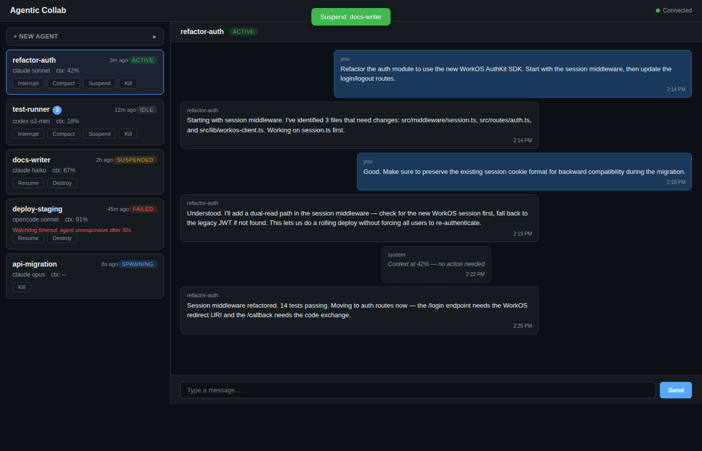
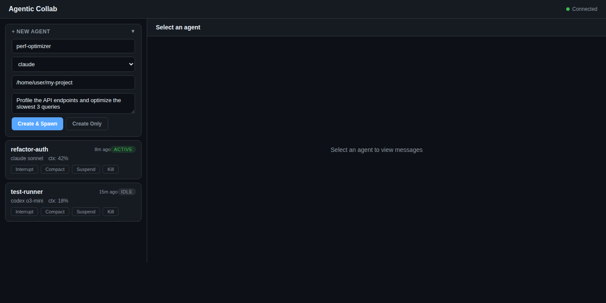
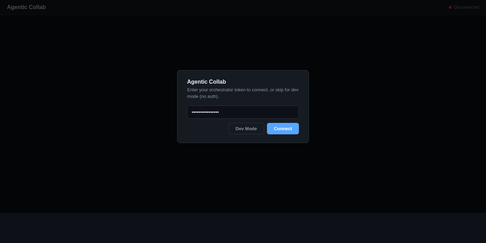

# agentic-collab

[](LICENSE)

Zero-dependency orchestrator for managing AI coding agents (Claude, Codex, OpenCode) via tmux sessions. Built on Node 24 — no build step, no npm install.

## Dashboard

Real-time dashboard for monitoring and controlling agents:



Create agents with a task and spawn them in one click:



Token auth modal for production deployments (dev mode skips auth):



## Architecture

```
┌──────────────────────────────────┐
│  Orchestrator (Docker, :3000)    │
│  ┌────────┐ ┌────────────────┐  │
│  │ SQLite  │ │ Health Monitor │  │
│  │ (WAL)   │ │ (30s poll)     │  │
│  └────────┘ └────────────────┘  │
│  ┌────────┐ ┌────────────────┐  │
│  │ HTTP   │ │ WebSocket      │  │
│  │ API    │ │ (live updates) │  │
│  └────────┘ └────────────────┘  │
└───────────────┬──────────────────┘
                │ HTTP
┌───────────────▼──────────────────┐
│  Proxy (host machine, :3100)     │
│  ┌──────────────────────────┐    │
│  │ tmux session management  │    │
│  │ create / paste / capture │    │
│  │ kill / send-keys          │    │
│  └──────────────────────────┘    │
└──────────────────────────────────┘
```

**Orchestrator** runs in Docker and manages agent state, message queues, and the dashboard. **Proxy** runs on the host where tmux is available and executes session commands on behalf of the orchestrator.

### Agent state machine

```
void → spawning → active ↔ idle → suspending → suspended
                    ↓                               ↓
                  failed ←──────────────────────────┘
                    ↓
                  (respawnable)
```

All lifecycle transitions use three-phase locking with optimistic concurrency (version column) and 30-second watchdog timers.

## Prerequisites

- **Node.js 24+** (native TypeScript via `--experimental-strip-types`)
- **Docker + Docker Compose** (for the orchestrator)
- **tmux** (on the host, for the proxy)
- At least one AI CLI tool: `claude`, `codex`, or `opencode`

## Quick start

### 1. Start the orchestrator

```bash
# Optional: set a shared secret for auth
export ORCHESTRATOR_SECRET=your-secret-here

docker compose up -d
```

The orchestrator runs at `http://localhost:3000`. The dashboard is at `http://localhost:3000/dashboard`.

### 2. Start a proxy on the host

```bash
# Set the same secret if you configured one
export ORCHESTRATOR_SECRET=your-secret-here

node src/proxy/main.ts
```

The proxy registers itself with the orchestrator and sends heartbeats every 15 seconds.

### 3. Create and spawn an agent

```bash
# Create an agent
curl -X POST http://localhost:3000/api/agents \
  -H 'Content-Type: application/json' \
  -H 'Authorization: Bearer your-secret-here' \
  -d '{"name": "my-agent", "engine": "claude", "cwd": "/path/to/project"}'

# Spawn it (starts a tmux session via the proxy)
curl -X POST http://localhost:3000/api/agents/my-agent/spawn \
  -H 'Authorization: Bearer your-secret-here'
```

Or use the dashboard at `http://localhost:3000/dashboard` for a visual interface.

## Environment variables

### Orchestrator

| Variable | Default | Description |
|----------|---------|-------------|
| `PORT` | `3000` | HTTP port |
| `DB_PATH` | `/data/.agentic-collab/orchestrator.db` | SQLite database path |
| `ORCHESTRATOR_HOST` | `http://localhost:{PORT}` | Public URL (used in agent system prompts) |
| `ORCHESTRATOR_SECRET` | _(none)_ | Bearer token for API auth; unset = no auth |

### Proxy

| Variable | Default | Description |
|----------|---------|-------------|
| `PROXY_PORT` | `3100` | HTTP port |
| `ORCHESTRATOR_URL` | `http://localhost:3000` | Orchestrator address |
| `PROXY_HOST` | `host.docker.internal:{PROXY_PORT}` | How the orchestrator reaches this proxy |
| `PROXY_ID` | `proxy-{random}` | Unique proxy identifier |
| `ORCHESTRATOR_SECRET` | _(none)_ | Must match orchestrator's secret |

## API

All `POST`/`DELETE` endpoints require `Authorization: Bearer <secret>` when `ORCHESTRATOR_SECRET` is set. `GET` endpoints are public.

### Agents

| Method | Path | Description |
|--------|------|-------------|
| `GET` | `/api/agents` | List all agents |
| `GET` | `/api/agents/:name` | Get agent details |
| `POST` | `/api/agents` | Create agent (`name`, `engine`, `cwd` required) |
| `DELETE` | `/api/agents/:name` | Delete agent |

### Lifecycle

| Method | Path | Description |
|--------|------|-------------|
| `POST` | `/api/agents/:name/spawn` | Start agent session |
| `POST` | `/api/agents/:name/suspend` | Suspend (saves tmux state) |
| `POST` | `/api/agents/:name/resume` | Resume suspended agent |
| `POST` | `/api/agents/:name/reload` | Reload session (immediate or queued) |
| `POST` | `/api/agents/:name/interrupt` | Send interrupt keys |
| `POST` | `/api/agents/:name/compact` | Compact agent context |
| `POST` | `/api/agents/:name/kill` | Hard-kill session |
| `POST` | `/api/agents/:name/destroy` | Destroy agent permanently |

### Messaging

| Method | Path | Description |
|--------|------|-------------|
| `POST` | `/api/agents/send` | Agent-to-agent message (queued) |
| `POST` | `/api/dashboard/send` | Dashboard-to-agent message (queued) |
| `POST` | `/api/dashboard/reply` | Record agent reply to dashboard |
| `GET` | `/api/dashboard/threads` | List conversation threads |
| `GET` | `/api/queue` | List pending messages |

### System

| Method | Path | Description |
|--------|------|-------------|
| `GET` | `/api/orchestrator/status` | Agent/proxy counts |
| `POST` | `/api/orchestrator/shutdown` | Graceful shutdown (suspends all agents) |
| `POST` | `/api/orchestrator/restore` | Restore agents after restart |
| `GET` | `/api/events/:agentName` | Agent event log |
| `GET` | `/api/proxies` | List registered proxies |

### WebSocket

Connect to `/ws?token=<secret>` for real-time updates. Events: `agent_update`, `proxy_update`, `queue_update`, `dashboard_message`.

## Health monitor

The orchestrator polls active/idle agents every 30 seconds:

- **Context threshold** (80%): sends `/compact` to reduce context usage
- **Reload threshold** (90%): kills and respawns the session with a task summary
- **Idle detection**: transitions agents between `active` and `idle` states
- **Message delivery**: delivers one queued message per poll cycle when agent is idle
- **Crash recovery**: on startup, restores agents stuck in transitional states (`suspending`, `resuming`)

## Engine adapters

Each AI engine has an adapter that handles:
- **Spawn command**: the CLI invocation to start the agent
- **Idle detection**: parsing tmux output to determine if the agent is waiting for input
- **Context parsing**: extracting context usage percentage from the status bar
- **Interrupt sequence**: engine-specific key sequences to interrupt execution

Supported engines: `claude`, `codex`, `opencode`.

## Testing

```bash
node --test 'src/**/*.test.ts'
```

220 tests across 44 suites covering lifecycle operations, database persistence, networking, locking, health monitoring, adapters, message delivery, crash recovery, integration tests, and input validation.

## Project structure

```
src/
├── orchestrator/           # Runs in Docker
│   ├── main.ts             # Server entry point
│   ├── database.ts         # SQLite persistence (WAL mode)
│   ├── routes.ts           # HTTP API (25+ endpoints)
│   ├── lifecycle.ts        # Agent state machine + 3-phase locking
│   ├── network.ts          # Graceful shutdown + crash recovery
│   ├── health-monitor.ts   # Polling, thresholds, message delivery
│   ├── persona.ts          # Agent system prompts
│   └── adapters/           # Engine-specific behavior
│       ├── claude.ts
│       ├── codex.ts
│       └── opencode.ts
├── proxy/                  # Runs on host
│   ├── main.ts             # Proxy server + heartbeat
│   └── tmux.ts             # tmux command execution
├── shared/                 # Used by both
│   ├── types.ts            # All shared types
│   ├── lock.ts             # SQLite-based lock manager
│   ├── agent-entity.ts     # Agent state helpers
│   ├── sanitize.ts         # Message sanitization
│   ├── websocket-server.ts # RFC 6455 implementation
│   └── utils.ts            # Shell quoting, sleep
└── dashboard/
    └── index.html          # Single-file SPA
```

## Design decisions

- **Zero dependencies**: Node 24 built-ins only (`node:sqlite`, `node:test`, `node:http`, `node:crypto`). No npm install required.
- **No build step**: TypeScript runs natively via `--experimental-strip-types`.
- **SQLite + WAL**: Single-file persistence with concurrent read support.
- **Optimistic concurrency**: Version column prevents lost updates during concurrent lifecycle operations.
- **Watchdog timers**: 30-second timeouts prevent hung operations from blocking agent state.
- **Timing-safe auth**: All secret comparisons use `crypto.timingSafeEqual`.

## License

ISC
